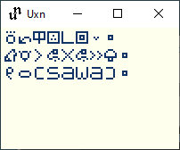

a visualiser for sitelen pona.

you need [uxn](https://100r.co/site/uxn.html) to run this.

# usage

write the words in the console or stdin. if a word isn't recognised, it will be typed out in latin letters.

to force a word to be typed, end the word with ".

among punctuation characters are (, ) and the full stop.

---

use the f3 key to take a screenshot, your emulator probably supports that.
